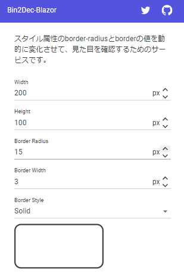

# Broder Radius Preview Wasm
スタイル属性のborder-radiusとborderの値を動的に変化させて、見た目を確認するためのサービスです。

## デモURL
[デモURL](https://kind-mud-0bd19d700.1.azurestaticapps.net)



## 確認環境
- .NET 6.0.202

## 始め方
```
dotnet run
```